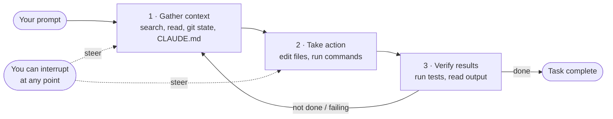

# Agentic Coding Loops in Voltpath PH 🤖🔁


> This doc explains the **agentic coding loop** — the mental model behind Claude
> Code — and how to apply it to _developing and operating this monorepo_. It is
> **not** about adding an LLM to the Voltpath product; it's about using an agentic
> assistant effectively on the codebase (interactively today, and headless via the
> Agent SDK later).
>
> References:
>
> - Mental model — <https://code.claude.com/docs/en/how-claude-code-works>
> - Headless mechanics (Agent SDK) — <https://code.claude.com/docs/en/agent-sdk/agent-loop>
> - Vendor-neutral background — <https://www.mindstudio.ai/blog/what-is-an-agentic-loop-ai-coding-agents>

---

## 1. The loop: gather context → take action → verify results

When you give Claude a task, it works through three phases that **blend together**,
using tools throughout, and **repeating until the task is complete**:



Key ideas from the reference, and what they mean here:

- **The phases adapt to the task.** A question about the energy model might be
  _gather only_. A bug fix cycles through all three repeatedly. A refactor leans
  heavy on _verify_.
- **Claude is the model; Claude Code is the _agentic harness_** around it —
  providing the tools, context management, and execution environment. The SDK is
  that same harness, embeddable in a script.
- **You are part of the loop.** You can interrupt (`Esc`) or type a correction
  mid-run to steer — you don't restart.

> **One loop, three names.** This is the same idea the wider field calls the
> **ReAct pattern** — _Reason → Act → Observe → Repeat_ (Thought → Action →
> Observation) — and the SDK frames as _evaluate → execute tools → repeat_. Its
> anatomy is always four parts: a **planner** (the model), a **tool set**, a
> **stopping condition**, and a **memory layer** (context). The "Code → Test → Fix"
> cycle below is just this loop pointed at code.

The canonical example, mapped to this repo — _"fix the failing energy-model tests"_:

1. run `npm test` (→ `turbo test`) to see failures — **gather**
2. read the error output — **gather**
3. search/read `packages/shared/src/energy.ts` + its tests — **gather**
4. edit the source — **act**
5. re-run `turbo test` — **verify** → loop until green

---

## 2. Phase by phase, grounded in Voltpath

### Phase 1 — Gather context

Claude explores the repo _agentically_ (it doesn't need everything pasted in):

| Source                    | In this repo                                                                  |
| ------------------------- | ----------------------------------------------------------------------------- |
| Project files             | the whole monorepo — `apps/api`, `apps/web`, `apps/mobile`, `packages/shared` |
| Search                    | Glob/Grep across workspaces — find the route, the entity, the schema          |
| Git state                 | current branch (`chore/codereview`), diff, recent commits                     |
| `CLAUDE.md`               | project conventions re-injected **every** request (see §5)                    |
| Auto memory / `MEMORY.md` | learnings saved across sessions                                               |
| Existing docs             | `docs/ARCHITECTURE.md`, `ENERGY_MODEL.md`, `DATABASE.md`, `TESTING.md`        |

> Because Claude sees the _whole_ project, it can make **coordinated edits** across
> `packages/shared` (the energy model / Zod schemas) and the `apps/api` route that
> consumes it — something a single-file assistant can't.

### Phase 2 — Take action

Tools turn reasoning into change. The categories that matter here:

| Category      | In this repo                                               |
| ------------- | ---------------------------------------------------------- |
| File ops      | edit `energy.ts`, an entity, a route, a test               |
| Execution     | `turbo test`, `npm run db:up`, `migration:generate`, `git` |
| Code intel    | type errors after edits (TS), jump-to-def/find-refs        |
| Web           | look up Google Maps / Open-Meteo API docs, error messages  |
| Orchestration | spawn **subagents**, invoke **skills**                     |

### Phase 3 — Verify results

The loop is only as good as what it can **check against** — and Voltpath has crisp,
machine-checkable gates straight from `package.json`:

| Gate             | Command                                                                           | What it proves                           |
| ---------------- | --------------------------------------------------------------------------------- | ---------------------------------------- |
| Tests pass       | `npm test` → `turbo test`                                                         | behavior intact (energy model: 18 cases) |
| Types check      | `npm run typecheck` → `turbo typecheck`                                           | no type regressions across workspaces    |
| Lint clean       | `npm run lint` → `turbo lint`                                                     | style/conventions                        |
| Scoped tests     | `jest` (api) · `vitest` (shared, web)                                             | fast, package-local feedback             |
| Model validation | analysis scripts — **MAPE ≤ 15%, RMSE ≤ 80 Wh/km** ([`TESTING.md`](./TESTING.md)) | the SoC model still calibrated           |

> **The single most effective thing you can do** is give the loop something to
> verify against. "Fix the SoC estimate" is weak; "Fix the SoC estimate so
> `turbo test --filter=@voltph/shared` passes; arrival SoC for the Makati→Baguio
> fixture should be ~6%" is strong — the loop self-corrects against the target.

---

## 3. Using it well on this codebase (interactive)

Applying the reference's "work effectively" guidance to Voltpath:

- **Be specific, point at files.** "The SoC verdict is wrong for heavy traffic —
  check `packages/shared/src/energy.ts` (the `Wtraffic` / time-based AC term, see
  `ENERGY_MODEL.md` §2). Write a failing test first, then fix it."
- **Give it a target to verify** (a failing test, expected numbers, a screenshot of
  the web map).
- **Explore before implementing.** For anything touching the energy model or DB
  schema, use **plan mode** (`Shift+Tab` ×2): _"Read `packages/shared/src/energy.ts`
  and `docs/ENERGY_MODEL.md`, then plan adding regen modeling — don't edit yet."_
  Review the plan, then let it implement.
- **Delegate, don't dictate.** Give context + direction; trust it to find the files.
- **Stay safe:** every edit is checkpointed (`Esc` `Esc` to rewind). Actions with
  external side effects (DB writes, deploys) are **not** checkpointable — which is
  exactly why destructive commands here (`db:reset`, `migration:run`) should stay
  approval-gated.

---

## 4. The same loop, headless (Agent SDK) — for automation

Everything above runs identically when embedded via `@anthropic-ai/claude-agent-sdk`
(no CLI needed). The harness yields a message stream and repeats **turns**
(evaluate → run tools → feed results back) until a turn has no tool calls.

```ts
// scripts/agents/fix-tests.ts  (conceptual — not committed)
import { query } from "@anthropic-ai/claude-agent-sdk";

for await (const m of query({
  prompt:
    "Fix failing tests in @voltph/shared. Only edit packages/shared. " +
    "Verify with `npm test -- --filter=@voltph/shared` and `npm run typecheck`.",
  options: {
    allowedTools: ["Read", "Edit", "Glob", "Grep", "Bash"],
    settingSources: ["project"], // load .claude/ + CLAUDE.md (same as interactive)
    permissionMode: "acceptEdits", // auto-approve edits on a dev machine
    maxTurns: 30, // cap the loop — prevent runaway sessions
    maxBudgetUsd: 2, // hard cost ceiling
    effort: "high", // thorough reasoning for debugging
  },
})) {
  if (m.type === "result") {
    console.log(m.subtype === "success" ? m.result : `Stopped: ${m.subtype}`);
    console.log(`Cost: $${m.total_cost_usd?.toFixed(4)}`);
  }
}
```

Candidate automations, ranked by value-to-effort:

| #   | Agent                               | Goal & why the loop fits                                                                                                                    |
| --- | ----------------------------------- | ------------------------------------------------------------------------------------------------------------------------------------------- |
| 1   | **"Make it green" test fixer**      | Edit until `turbo test` + `turbo typecheck` pass; scope to one workspace. Machine-checkable.                                                |
| 2   | **Migration drafter**               | Run `migration:generate` after entity edits, sanity-check SQL vs. [`DATABASE.md`](./DATABASE.md); human runs it.                            |
| 3   | **Energy-model calibration runner** | Run validation over new logs, propose `Wtraffic`/`Welevation`/`Wtemperature` tweaks as a **diff + rationale**, never auto-edit `energy.ts`. |
| 4   | **Station data reconciliation**     | Offline: compare `ChargingStation` rows vs. Google Places, emit a review file. Mistakes go to a queue, not a driver.                        |
| 5   | **CI assistant**                    | PR-triggered: lint/typecheck, draft changelog, keep `docs/` in sync. `bypassPermissions` **only** in the CI container.                      |

**Not worth a loop** ❌: routine `npm run format`/`lint`, deterministic codegen, and
**any unattended edit to the safety-critical SoC math** (the agent may run & report,
never silently rewrite it).

---

## 5. Project setup that helps every loop

The repo already has a `.claude/` directory. Two low-effort, high-leverage additions
make _both_ interactive and headless loops better:

1. **A `CLAUDE.md`** (run `/init` to scaffold) — durable conventions that survive
   compaction because they're re-injected every request. Worth capturing:
   - the monorepo layout + how to run/verify (`turbo test`, scoped `--filter`)
   - "the energy model is the scientific core — propose diffs, don't silently edit;
     keep it deterministic" (see [`ENERGY_MODEL.md`](./ENERGY_MODEL.md))
   - PostGIS/migration conventions ([`DATABASE.md`](./DATABASE.md))
   - a **Compact Instructions** section: preserve task objective, files touched,
     test results, decisions
2. **A `.claude/settings.json` allowlist** for trusted read/verify commands so the
   loop doesn't prompt each time, e.g. `Bash(npm test:*)`, `Bash(npx turbo *)`,
   `Bash(git status)`, `Bash(git diff:*)` — while **excluding** destructive ones
   (`db:reset`, `migration:run`) so they stay gated.

### Context, subagents, safety

- **Context fills as the loop runs** (history + tool outputs). Big test logs/files
  are the main cost; Claude auto-compacts but early instructions can be lost — hence
  `CLAUDE.md`. Run `/context` to inspect.
- **Subagents get a fresh context** and return only a summary — map them to
  workspace boundaries (a `shared` agent, an `api` agent) for long jobs so the
  orchestrator's context stays lean.
- **Permissions** (`Shift+Tab` interactively; `permissionMode` in the SDK): default
  asks, `acceptEdits` for autonomous edits, `plan` to explore safely,
  `bypassPermissions` only in CI/containers.
- **Hooks** are your hard rail: a `PreToolUse` hook can **block** any `Bash`
  matching `db:reset`/`migration:run`/`git push`; a `Stop` hook can re-run
  `turbo test` to confirm "done" actually means green.

---

## 6. Failure modes & guardrails ⚠️

The well-known agentic-loop failure modes, each mapped to a concrete guardrail here:

| Failure mode                                     | Guardrail in this repo                                                                                                                |
| ------------------------------------------------ | ------------------------------------------------------------------------------------------------------------------------------------- |
| **Cheating on tests** (edits the test to pass)   | protect test files (don't include them in the edit scope when the goal is to fix _source_); **always review the diff** before merging |
| **Superficial / fragile fixes**                  | require the loop to add a _failing_ test first, then make it pass                                                                     |
| **Scope creep** (wandering into unrelated files) | scope the prompt + Turbo `--filter`; subagent per package                                                                             |
| **Underspecified goal**                          | give a success state + constraints + a thing to verify (see §2)                                                                       |
| **Trusting self-assessment**                     | trust exit codes, not prose; `Stop` hook re-runs `turbo test`                                                                         |
| **Skipping diff review**                         | human reviews every diff; treat agent output like a PR                                                                                |
| Runaway turns / cost                             | `maxTurns` + `maxBudgetUsd` on every headless run                                                                                     |
| Destructive Bash (`db:reset`, `migration:run`)   | keep off the allowlist; `PreToolUse` hook denies them                                                                                 |
| Lost instructions after compaction               | durable rules in `CLAUDE.md`, not the one-off prompt                                                                                  |
| Silent edits to the SoC model                    | calibration agent proposes diffs only; human applies                                                                                  |
| Secrets in context                               | don't read `.env` into the loop; keys stay in the shell/CI env                                                                        |

> **Sandbox high-risk runs.** Let autonomous agents work on a **git branch or
> worktree** (this repo already uses feature branches, e.g. `chore/codereview`);
> review the diff before merging. Checkpoints (`Esc` `Esc`) cover file edits but
> **not** external side effects — another reason DB/deploy commands stay gated.

---

## 7. TL;DR

- The agentic loop = **gather context → take action → verify results**, repeated,
  with you able to interrupt and steer.
- It works best when you **point it at files** and **give it something to verify** —
  and Voltpath has ready-made gates (`turbo test`/`typecheck`, the energy model's 18
  cases, MAPE/RMSE targets).
- The **same loop runs headless** via the Agent SDK for automation; best first
  automation is a **"make it green" test fixer**, best ops one is **offline station
  reconciliation**.
- Set up a **`CLAUDE.md` + `.claude/settings.json` allowlist** now — it improves
  every session. Always **cap turns/budget, scope `Bash`, hook-block destructive
  commands, and keep the SoC model out of unattended edits.**

---

### See also

- Mental model — <https://code.claude.com/docs/en/how-claude-code-works>
- Headless mechanics — <https://code.claude.com/docs/en/agent-sdk/agent-loop>
- Vendor-neutral background (ReAct, failure modes) — <https://www.mindstudio.ai/blog/what-is-an-agentic-loop-ai-coding-agents>
- [`TESTING.md`](./TESTING.md) — the gates the loop verifies against
- [`ENERGY_MODEL.md`](./ENERGY_MODEL.md) — the deterministic core to protect
- [`DATABASE.md`](./DATABASE.md) · [`DEVOPS.md`](./DEVOPS.md) — schema & toolchain
