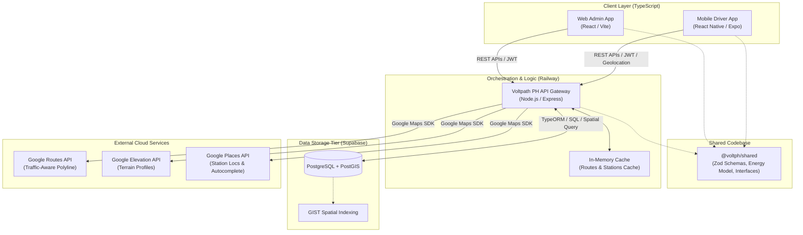
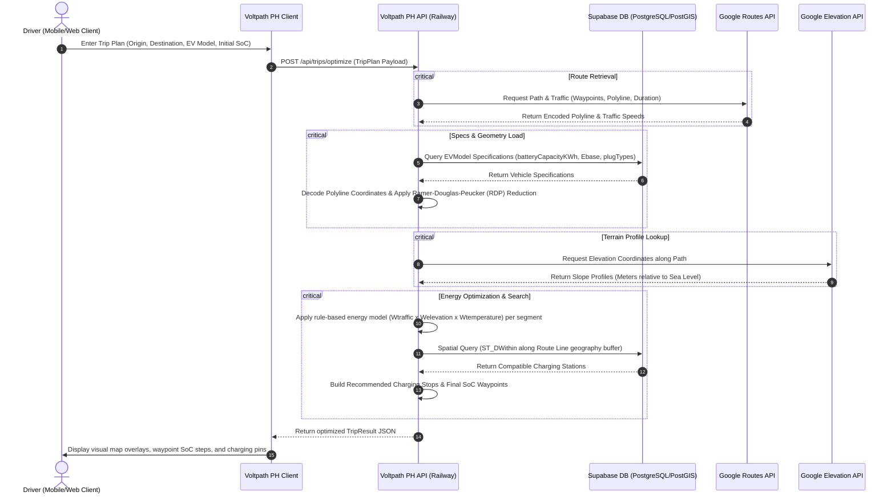
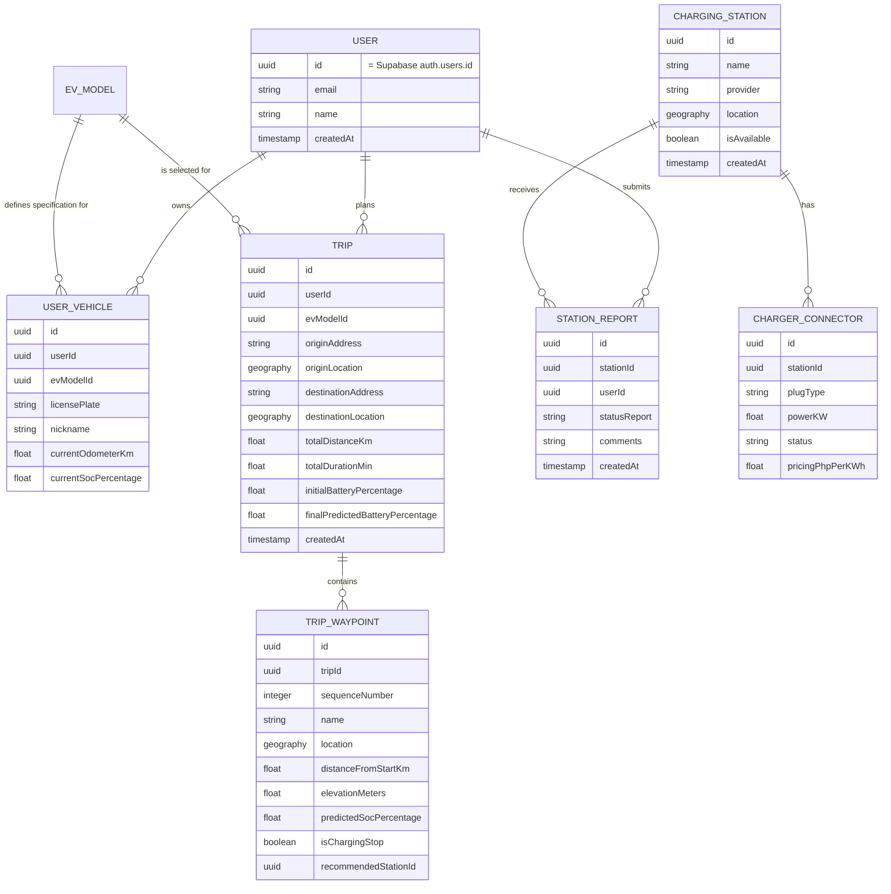

# System Architecture 🏛

This document describes the high-level architecture of the Voltpath PH platform.

## Architecture Diagram

## Component Breakdown

### 1. Client Applications

- **Web App:** A Vite-powered React application for administrators and managers.
- **Mobile App:** An Expo-powered React Native application for drivers, integrating geolocation APIs, native maps, and offline syncing.
- Both apps share validation schemas and interfaces via the shared package.

### 2. Backend API

- **Technology:** Node.js Express with TypeScript and TypeORM.
- **Orchestration:** Coordinates Google Maps Services (Routes, Elevation, Places) with database spatial searches to predict segment consumption and find stations.
- **Authentication:** Verifies **Supabase Auth** JWTs in middleware on protected routes; the API itself does not issue or store credentials.
- **Caching:** In-memory caching for Google Routes/Elevation calls to optimize response latency and minimize API fees.

### 3. Data Tier (Supabase)

- **PostgreSQL 15:** Cloud-hosted managed database on Supabase (connected via the session pooler / direct connection).
- **PostGIS:** Spatial database extension storing locations as `Point` coordinates (SRID 4326), with GIST spatial indexing for radius and route buffer searches.
- **Supabase Auth:** Manages user credentials and JWT issuance in the `auth.users` schema; application `user` profiles are keyed by `auth.users.id`.

### 4. Shared Logic (`packages/shared`)

- **Energy Model:** The canonical rule-based multiplicative model `E = Ebase × Wtraffic × Welevation × Wtemperature` with locally-calibrated weights (a physics force-model is retained as future work — see the `voltph-ev-physics` skill).
- **Validation:** Type-safe validators using `zod` to validate all API request/response payloads.

## Sequence Diagram: Trip Optimization Workflow

This diagram illustrates the flow of data when a user plans a trip and requests route optimization.

## Entity Relationship Diagram (ERD)

The following diagram represents the core data models and their relationships, tailored for rule-based energy estimation and crowdsourced status reporting. User credentials are managed by Supabase Auth (`auth.users`); the `USER` table is an application profile keyed by that ID.

