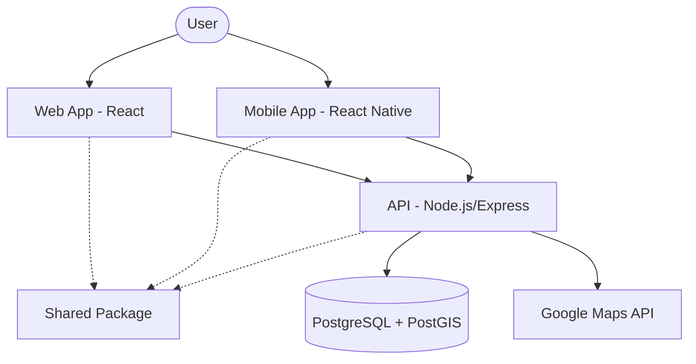

# System Architecture 🏛

This document describes the high-level architecture of the VoltPH platform.

## Architecture Diagram

## Component Breakdown

### 1. Client Applications
- **Web App:** A Vite-powered React application for desktop users.
- **Mobile App:** An Expo-powered React Native application for users on the go.
- Both apps share business logic and type definitions via the `shared` package.

### 2. Backend API
- **Technology:** Express.js with TypeScript.
- **Responsibilities:**
  - Managing EV model data.
  - Locating charging stations.
  - Orchestrating trip optimization by combining Google Maps data with EV consumption models.

### 3. Data Layer
- **PostgreSQL:** Primary relational store.
- **PostGIS:** Extension used for storing charging station locations as `Point` geographies, allowing for efficient "nearby" searches.

### 4. Shared Logic (`packages/shared`)
- This is a local NPM package within the monorepo.
- It contains `interfaces`, `validation schemas`, and `calculation utilities` to ensure consistency across all services.

## Data Flow: Trip Optimization
1. User inputs origin and destination in the app.
2. App sends request to `/api/trips/optimize`.
3. API calls **Google Routes API** to get the polyline and distance.
4. API fetches the user's **EV Model** specs from the DB.
5. API calculates consumption.
6. API performs a spatial query to find charging stations within a buffer of the route.
7. API returns the optimized plan to the user.
