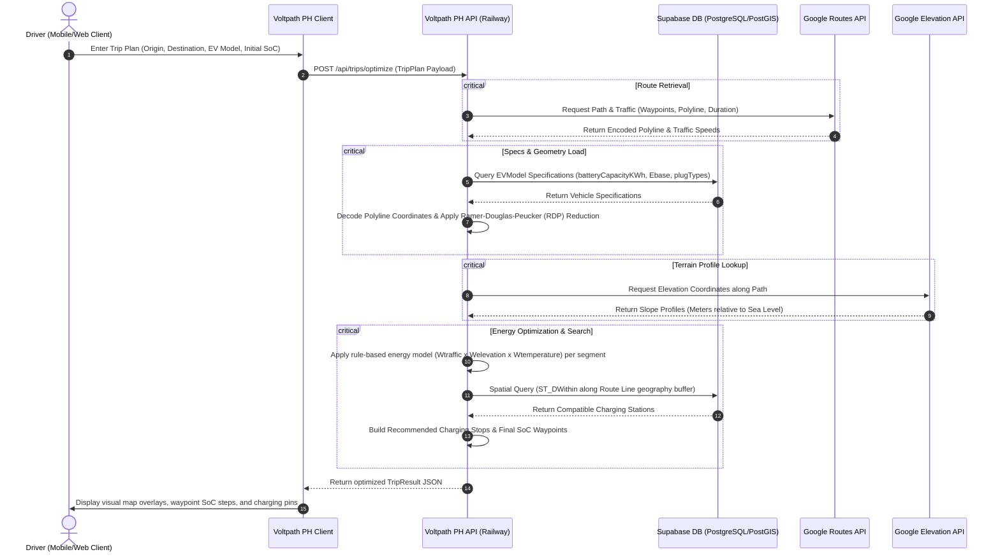

# Backend API Documentation 🔙💻


The Voltpath PH Backend is a Node.js Express application built with TypeScript and TypeORM, using PostgreSQL and PostGIS for geospatial data management.

## 🚀 Getting Started

### Prerequisites

- Node.js (v18+)
- A **Supabase** project (PostgreSQL 15 + PostGIS + Supabase Auth) — or Docker + local PostgreSQL/PostGIS for offline development
- Google Maps Platform API key (Routes, Places, Elevation)

### Environment Variables

The complete, commented list of variables — including optional tuning knobs — is in **`apps/api/.env.example`**; copy it to `.env` and fill in real values. All variables are read centrally in **`src/config.ts`** (with safe defaults), so add new configuration there rather than reading `process.env` elsewhere. Against Supabase, prefer the single `DATABASE_URL` connection string (use the **session pooler on port 5432** or the direct connection — not the transaction pooler on 6543, which TypeORM's prepared statements don't support):

```env
PORT=3001

# Supabase Postgres (canonical)
DATABASE_URL=postgresql://postgres:<password>@<project>.supabase.co:5432/postgres

# Supabase Auth (the API verifies tokens; it does not sign them)
SUPABASE_URL=https://<project>.supabase.co
SUPABASE_SERVICE_ROLE_KEY=your_service_role_key
SUPABASE_JWT_SECRET=your_supabase_jwt_secret

GOOGLE_MAPS_API_KEY=your_google_maps_key
```

> **Local-only alternative:** for offline dev without Supabase, set the discrete `DB_HOST` / `DB_PORT` / `DB_USERNAME` / `DB_PASSWORD` / `DB_DATABASE` variables instead of `DATABASE_URL` (the data source falls back to these when `DATABASE_URL` is unset). Enable PostGIS locally with `CREATE EXTENSION IF NOT EXISTS postgis;`.

### Local Development

1. Navigate to the api directory: `cd apps/api`
2. Run in development mode: `npm run dev`
3. Build for production: `npm run build`
4. Start production server: `npm run start`

> **Note:** If you encounter `TS2564` errors regarding property initialization in entities, ensure you are using definite assignment assertions (`!`) as per our TypeORM standards. Missing types for `cors` should be installed as a dev dependency (`@types/cors`).

## 🛣 API Endpoints Reference

### EV Models

Manage and retrieve supported Electric Vehicle specifications.

- **GET `/api/ev-models`**
  - Description: Returns a list of all supported EV models.
  - Response: `Array<EVModel>`

- **GET `/api/ev-models/:id`**
  - Description: Returns details for a specific EV model.
  - Parameters: `id` (UUID)
  - Response: `EVModel`

### Charging Stations

Geospatial search for charging infrastructure.

- **GET `/api/stations/nearby`**
  - Description: Finds charging stations within a specified radius.
  - Query Parameters:
    - `lat` (float, required): Latitude of the center point.
    - `lng` (float, required): Longitude of the center point.
    - `radius` (int, optional): Search radius in meters (default: 5000).
  - Response: `Array<ChargingStation>`

### Trip Optimization

The core engine for route and battery calculation.

- **POST `/api/trips/optimize`**
  - Description: Calculates route, battery consumption, and recommends charging stops.
  - Request Body: `TripPlan`
  - Response: `TripResult`

#### Trip Optimization Sequence Workflow



## 🗄 Database & Geospatial

Voltpath PH uses **PostgreSQL** with the **PostGIS** extension to handle spatial data.

For a comprehensive guide on database structure, column types, relationship diagrams, and query optimizations, see the [Database Architecture Documentation](./DATABASE.md).

- **Coordinate System:** All geographical coordinates use standard **SRID 4326** (WGS 84 GPS standard).
- **Spatial Indexing:** GIST indices are utilized on `location` coordinates for high-performance radius queries.
- **TypeORM Entities:** Stored under `apps/api/src/entities/`.

## 🧪 Testing & Quality

- **Linter:** ESLint
- **Formatter:** Prettier
- **Testing Framework:** Jest (Planned)

Run linting:

```bash
npm run lint
```
